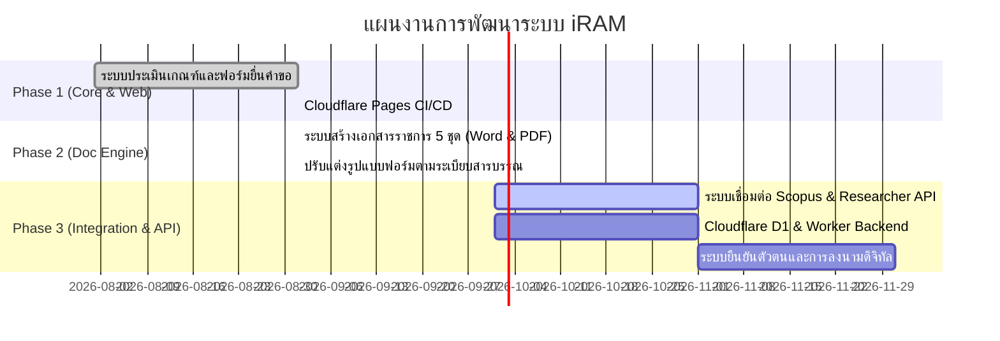

# แผนงานและการพัฒนา (Roadmap & Development Plan) — iRAM Ecosystem

เอกสารสรุปแผนงานการพัฒนาระบบนิเวศสารสนเทศงานวิจัย (iRAM Ecosystem) คณะแพทยศาสตร์ มหาวิทยาลัยนเรศวร

---

## 🗺️ แผนการดำเนินงาน (Roadmap Overview)

---

## 📌 รายละเอียดแต่ละระยะ (Phases)

### ✅ Phase 1: Core System & Evaluation Engine (เสร็จสมบูรณ์ v1.0.0)
- [x] **Online Gatekeeper:** ตรวจสอบคุณสมบัติผู้ยื่นคำขอตามเกณฑ์และประกาศคณะ/มหาวิทยาลัย
- [x] **Smart Calculation:** คำนวณเงินค่าตีพิมพ์ (Page Charge ไม่เกิน 70,000 บาท) และเงินรางวัลตามระดับ Quartile
- [x] **Department & Saraban Auto-fill:** ดึงสังกัดและรหัสหนังสือราชการอัตโนมัติ
- [x] **Responsive UI & Cloudflare Deployment:** รองรับการใช้งานผ่าน Web Browser บน [https://iram-reward-system.pages.dev](https://iram-reward-system.pages.dev)

### ✅ Phase 2: Official Document Generation Engine (เสร็จสมบูรณ์ v1.0.0)
- [x] **Checklist (แบบตรวจสอบหลักฐาน):** แสดงรายการเอกสารแนบและเงื่อนไขอัตโนมัติ
- [x] **บันทึกข้อความขออนุมัติเงินรางวัล:** ปรับระยะบรรทัด 1.0 จัดหน้ากระดาษแบบราชการไทย (TH Sarabun PSK)
- [x] **บันทึกข้อความขออนุมัติเบิกเงินค่าตอบแทนและค่าใช้จ่าย:** จัดระเบียบข้อความ ชิดขอบและไม่ถ่างตัวอักษร
- [x] **ใบสำคัญรับเงิน (Receipt Voucher):** ตารางแนวตั้งยาวตลอด เว้นระยะ Padding สวยงาม ไม่มีสัญลักษณ์ ฿
- [x] **ใบรับรองการจ่ายเงิน (ข้อ 46):** เว้นระยะขอบขวาของตาราง 1-2 เคาะ จัดขอบเสมอแบบ Justified โดยไม่ถ่างตัวอักษร
- [x] **Dynamic Rows:** ปรับแถวตารางว่างให้พอดีใน 1 หน้ากระดาษ A4 ไม่ล้นเกิน

### 🔄 Phase 3: Integration, Data Pipeline & API Sync (ระยะถัดไป)
- [ ] **Scopus Automation Fetcher:** เชื่อมต่อระบบดึงข้อมูลผลงานตีพิมพ์จาก Scopus อัตโนมัติด้วย DOI
- [ ] **Researcher Profile Sync:** ซิงก์ข้อมูลนักวิจัย (ตำแหน่งวิชาการ, ภาควิชา, Scopus Author ID)
- [ ] **Backend Database (Cloudflare D1 / Workers):** บันทึกและติดตามสถานะคำขอแบบเรียลไทม์
- [ ] **E-Signature & Tracking:** ระบบลงนามอิเล็กทรอนิกส์และติดตามสถานะการเบิกจ่าย

---

## 💾 ข้อมูลการแบคอัพ (Backup Metadata)
- **Tag:** `v1.0.0`
- **Release Date:** 25 กันยายน 2569
- **Stable Deployment:** [https://iram-reward-system.pages.dev](https://iram-reward-system.pages.dev)
