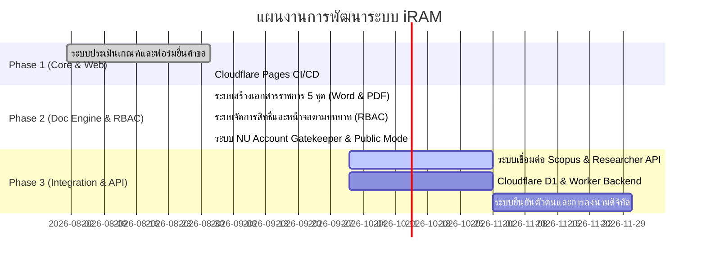

# แผนงานและการพัฒนา (Roadmap & Development Plan) — iRAM Ecosystem

เอกสารสรุปแผนงานการพัฒนาระบบนิเวศสารสนเทศงานวิจัย (iRAM Ecosystem) คณะแพทยศาสตร์ มหาวิทยาลัยนเรศวร

---

## 🗺️ แผนการดำเนินงาน (Roadmap Overview)

```mermaid
gantt
    title แผนงานการพัฒนาระบบ iRAM
    dateFormat  YYYY-MM
    section Phase 1 (Core & Web)
    ระบบประเมินเกณฑ์และฟอร์มยื่นคำขอ   :done, 2026-08, 2026-09
    Cloudflare Pages CI/CD             :done, 2026-09, 2026-09
    section Phase 2 (Doc Engine & RBAC)
    ระบบสร้างเอกสารราชการ 5 ชุด (Word & PDF) :done, 2026-09, 2026-09
    ระบบจัดการสิทธิ์และหน้าจอตามบทบาท (RBAC)  :done, 2026-09, 2026-09
    ระบบ NU Account Gatekeeper & Public Mode :done, 2026-09, 2026-09
    section Phase 3 (Integration & API)
    ระบบเชื่อมต่อ Scopus & Researcher API :active, 2026-10, 2026-11
    Cloudflare D1 & Worker Backend      :2026-10, 2026-11
    ระบบยืนยันตัวตนและการลงนามดิจิทัล      :2026-11, 2026-12
```

---

## 📌 รายละเอียดแต่ละระยะ (Phases)

### ✅ Phase 1: Core System & Evaluation Engine (เสร็จสมบูรณ์ v1.0.0)
- [x] **Online Gatekeeper:** ตรวจสอบคุณสมบัติผู้ยื่นคำขอตามเกณฑ์และประกาศคณะ/มหาวิทยาลัย
- [x] **Smart Calculation:** คำนวณเงินค่าตีพิมพ์ (Page Charge ไม่เกิน 70,000 บาท) และเงินรางวัลตามระดับ Quartile
- [x] **Department & Saraban Auto-fill:** ดึงสังกัดและรหัสหนังสือราชการอัตโนมัติ
- [x] **Responsive UI & Cloudflare Deployment:** รองรับการใช้งานผ่าน Web Browser บน [https://iram-reward-system.pages.dev](https://iram-reward-system.pages.dev)

### ✅ Phase 2: Official Document Generation Engine (เสร็จสมบูรณ์ v1.0.0)
- [x] **Checklist (แบบตรวจสอบหลักฐาน):** แสดงรายการเอกสารแนบและเงื่อนไขอัตโนมัติ
- [x] **บันทึกข้อความขออนุมัติเงินรางวัล:** ปรับระยะบรรทัด 1.0 จัดหน้ากระดาษแบบราชการไทย (TH Sarabun PSK)
- [x] **บันทึกข้อความขออนุมัติเบิกเงินค่าตอบแทนและค่าใช้จ่าย:** จัดระเบียบข้อความ ชิดขอบและไม่ถ่างตัวอักษร
- [x] **ใบสำคัญรับเงิน (Receipt Voucher):** ตารางแนวตั้งยาวตลอด เว้นระยะ Padding สวยงาม ไม่มีสัญลักษณ์ ฿
- [x] **ใบรับรองการจ่ายเงิน (ข้อ 46):** เว้นระยะขอบขวาของตาราง 1-2 เคาะ จัดขอบเสมอแบบ Justified โดยไม่ถ่างตัวอักษร
- [x] **Dynamic Rows:** ปรับแถวตารางว่างให้พอดีใน 1 หน้ากระดาษ A4 ไม่ล้นเกิน

### ✅ Phase 2.5: User Roles, RBAC & Admin Console (เสร็จสมบูรณ์ v1.1.0)
- [x] **5 Distinct User Roles:** รองรับบทบาทนักวิจัย (Researcher), จนท.วิจัย (Coordinator), งานการเงิน (Finance), ผู้บริหาร (Executive), และผู้ดูแลระบบ (Admin)
- [x] **Role-Based Header & Navigation Cleanup:** จัดระเบียบหน้าจอตามบทบาท ซ่อนเมนูและเครื่องมือที่ไม่เกี่ยวข้อง เช่น Kanban/LINE OA/Admin Console ให้เห็นเฉพาะผู้มีสิทธิ์
- [x] **User Management Console:** ทะเบียนผู้ใช้งานรวมศูนย์ ค้นหา กรองบทบาท/ภาควิชา และ Quick Role Switcher
- [x] **PDPA Security Gate & Sensitive Data Masking:** ล็อกหน้าจอ Admin ด้วยรหัสผ่านความปลอดภัย และระบบซ่อนเลขบัญชี/บัตรประชาชน
- [x] **Route Guard:** ป้องกันหน้าจอค้างข้ามบทบาท สลับกลับสู่แดชบอร์ดอัตโนมัติเมื่อเปลี่ยนสิทธิ์

### ✅ Phase 2.6: NU Account Gatekeeper & Public vs Private Dashboard (เสร็จสมบูรณ์ v1.2.0)
- [x] **Zero Information Leakage:** ซ่อนรายชื่ออาจารย์ ตารางคำขอ ยอดเงินส่วนบุคคล และเลข AWP 100% สำหรับผู้เยี่ยมชมทั่วไป (Guest Mode)
- [x] **Public Header & Dashboard:** แสดงเฉพาะสถิติภาพรวม Quartile, สรุปยอดเงินรวมทั้งคณะ, และประกาศมหาวิทยาลัยนเรศวร พ.ศ. 2567
- [x] **NU Google Workspace Integration:** ตรวจสอบอีเมลโดเมน `@nu.ac.th` พร้อม Auto-provisioning สร้างสิทธิ์นักวิจัยให้อัตโนมัติเมื่อเข้าสู่ระบบครั้งแรก
- [x] **Quick Demo Switcher:** อำนวยความสะดวกในการตรวจประเมินระบบ สามารถสลับเข้าใช้งาน 5 บทบาทได้ทันที
- [x] **Secure Session & Logout:** จัดการสถานะการเข้าสู่ระบบอย่างปลอดภัย และมีปุ่มออกจากระบบ (Logout) คืนสู่ Guest Mode ทันที

### 🔄 Phase 3: Integration, Data Pipeline & API Sync (ระยะถัดไป)
- [x] **Backend Database (Cloudflare D1 & Worker):** เชื่อมต่อฐานข้อมูล `iram-db` และ Worker API สำหรับบันทึกคำขอรับทุน
- [ ] **Scopus Automation Fetcher:** เชื่อมต่อระบบดึงข้อมูลผลงานตีพิมพ์จาก Scopus อัตโนมัติด้วย DOI
- [ ] **Researcher Profile Sync:** ซิงก์ข้อมูลนักวิจัย (ตำแหน่งวิชาการ, ภาควิชา, Scopus Author ID)
- [ ] **E-Signature & Tracking:** ระบบลงนามอิเล็กทรอนิกส์และติดตามสถานะการเบิกจ่าย

---

## 💾 ข้อมูลการแบคอัพ (Backup Metadata)
- **Tag:** `v1.2.0`
- **Release Date:** 28 กันยายน 2569
- **Repository:** `https://github.com/SolarXtr/iram-reward-system.git`
- **Production URL:** `https://iram-reward-system.pages.dev`
